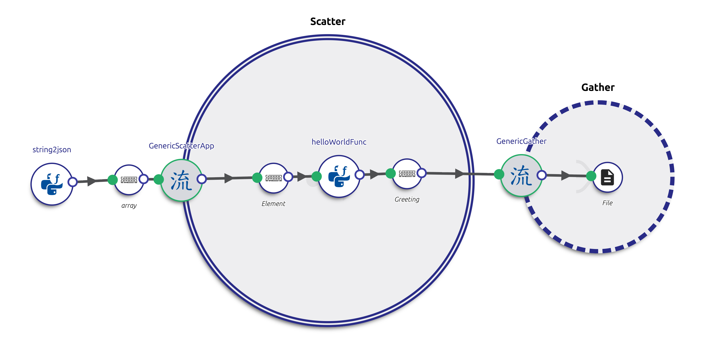
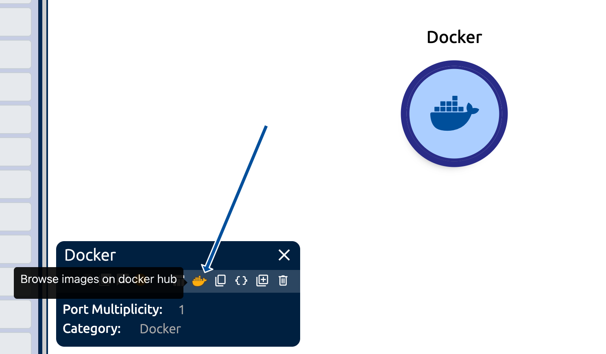

Components
==========

Components are the building blocks of workflows in EAGLE.
Each component represents executable logic or data handling behavior.

Common component categories include:

- Application components: shell, Python, C/C++, MPI, and other payloads.
- Data components: Memory, File, S3, NGAS, and related data stores.

EAGLE works from component descriptions (JSON metadata).
These descriptions define ports, parameters, and behavior needed for editing and translation.

  Components have inputs, outputs, and parameters, and are connected by edges.

Component Parameterisation
--------------------------

A component usually has two kinds of values:

- Component parameters: required by DALiuGE to instantiate and manage the component.
- Application arguments: values passed to the payload code.

Example:

- ``Application Class`` can point to ``dlg.apps.simple.HelloWorldApp``.
- ``Greet`` can be set to ``World`` and changed by users or :doc:`graph configuration <graphConfigurations>`.

Parameters and arguments can also be exposed as input or output ports.
This lets upstream components drive downstream behavior.

Creating Components for Docker Images
-------------------------------------

You can create Docker-based components from existing images on dockerhub using the builtin wizard shown below.

  Fill Docker parameters from your selected image.

Additional options can be configured in the ``Parameter Table`` which you can access via the graph inspector when the node is selected.

Important Notes on Docker Images
--------------------------------

For DALiuGE execution compatibility, Docker images should include:

- ``/bin/bash``
- ``/usr/bin/cat``
- ``/etc/passwd``

Recommended:

- ``/usr/bin/ls``
