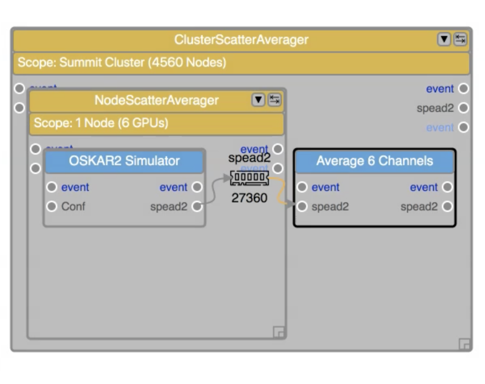
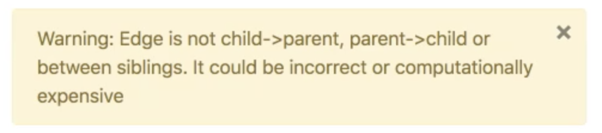

Components
==========

Components are created by application developers and others to be used within an
EAGLE workflow. The components payload or code exists outside of EAGLE, and may be
*Application Components* such as command line (shell) code, in-line Python and C/C++ dynamic libraries, and MPI code; or they can be *Data Components*, such as Memory, File, S3 and NGAS. Each of these provide different underlying functionality and integration.

To create a workflow, EAGLE only needs to access JSON representations of each component, which contain enough information to translate the workflow into a graph and then execute it correctly. These JSON files are referred to as *component descriptions* or :doc:`Palettes <palettes>`.

During the execution of a workflow, the executables and data wrapped by a component description have to be available to the execution engine; however, during the development of a Palette or translation into a Physical Graph Template, these don't need to be accessible by EAGLE.

In this documentation, no distinction is made between the component's external code and its description unless it is necessary for clarity.

  An example of different types of components in EAGLE. Each component has inputs and outputs. They can be arranged as parents and children, and their inputs and outputs can be linked using *edges*.

Each component has a set of inputs and outputs, as well as exposed parameters. Executable code called by an Application Component may range from the most simple -- for example, just a single mathematical operation in Python or C, to a complete and complex workflow all by itself. The inner workings of the Application Component are not handled or even visible within EAGLE.

In combination, components allow the parallel reduction of many individual data sets.

Component parameterisation
--------------------------

In general components require inputs and produce outputs and very often they require some static input parameters and optional keyword parameters as well. An EAGLE component requires two sets of distinct parameters, *Component parameters* and *Application arguments*. *Component parameters* are parameters required for the DALiuGE engine to manage and instatiate the component itself. The *Application arguments* are parameters exposed by the actual application or payload code. For example, the *Application Class* *Component parameter* contains a dot delimited string allowing the DALiuGE engine to import the actual payload code at run-time. In the HelloWorldApp (which is part of the Builin Component palette), the *Application Class* parameter is set to ``dlg.apps.simple.HelloWorldApp`` and ``readonly``. That `HelloWorldApp` also has an *Application argument* called ``Greet``, which is set to ``World`` and ``readwrite`` by default. Changing the value of that argument to ``Universe`` will result in an output of ``Hello Universe``. 

In addition component parameters and application arguments can be used as an `Input port` and/or as an `Output port`. By default that means that the *value* of that parameter or argument is read and/or written from/to a port or essentially from/to the previous/next component. For our HelloWorldApp that means that the value for ``Greet`` could be generated by another component and then fed into the actual application. The whole example, including some paralellism, can be explored directly in `EAGLE <http://localhost:8888/?service=GitHub&repository=ICRAR/EAGLE-graph-repo&branch=master&path=examples&filename=HelloWorld-Universe.graph>`_, the following is just a screenshot.

.. figure:: _static/images/HelloWorldUniverse.png
  :width: 400px
  :align: center
  :alt: HelloWorldUniverse example graph in EAGLE
  :figclass: align-center

  An example of different types of components in EAGLE. Each component has inputs and outputs. They can be arranged as parents and children, and their inputs and outputs can be linked using *edges*.

This graph is using two Python components ``String2JSON`` and the ``HelloWorldApp`` It also uses a ``Scatter`` and a ``Gather`` construct. ``String2JSON`` generates a JSON string using the value of an *Application argument* called ``string``. In the example the value is an array with 6 values. The ``Scatter`` construct is splitting this up 6-ways, where the number 6 is a *Component parameter* of the ``Scatter`` construct and can be changed there. Inside the ``Scatter`` there is first the *Element* memory component, which is passed on to the ``HelloWorldApp`` as the value for the *Application argument* ``Greet``. The ``HelloWorldApp`` is directed to write to a ``Greeting`` memory component. That ``Greeting`` component is used as an input to the ``Gather``, which has a *Component parameter* called ``Number of inputs`` set to 3. This means that it is gathering 3 inputs and writes those inputs to the ``File`` component inside the ``Gather``. Since there are 6 inputs from the ``Scatter``, this will result in two Files being generated in order to gather all the inputs. As a final result there will be two files inside the ``Gather`` each containing three greetings from the original list generated by ``String2JSON``. Note that the ``File`` component is not specifying an absolute name or path in its *Component parameter* settings. In this case DALiuGE will generate a unique filename and place that in the associated session directory at run time. That way any files generated during a workflow will not overwrite each other and it is thus recommended to leave that *Component argument* empty. Note also, that DALiuGE allows to exchange data component types, e.g. from *File* to *Memory* without the application needing to be changed  (this does not work for Bash components, since they can't read or write from/to memory).

Creating Components for Docker Images
-------------------------------------

The process for generating component descriptions for applications contained in Docker images is as follows:

Locate the image you wish to use on Docker Hub. For example, the ICRAR images are stored at https://hub.docker.com/u/icrar

Create a new graph and then create one Docker node from the Template Palette

  A new graph containing a single Docker node

Click the node to modify its attributes:

* The "Image" field should contain the name of the image, for example, icrar/leap_cli
* The "Tag" field should contain the image tag, for example, 0.8.1.
* The "Digest" field should contain the hexadecimal hash of that version.
* The "Command"
* The "User"
* The "Ensure User And Switch"
* The "Remove Container"
* The "Additional Bindings"

  Modify the Docker node parameters with data from the Docker image

Important Notes on Docker Images
--------------------------------

DALiuGE can only execute applications from Docker containers that satisfy the following requirements:

* pack a Bash shell (/bin/bash)
* pack /usr/bin/cat
* pack /etc/passwd
* It is also recommended to pack /usr/bin/ls.

Linking Components with Edges
-----------------------------

Within EAGLE, an output port from one component may be connected to the input port of another component via an *edge*. This is illustrated graphically by an arrow linking the two. An edge represents an event triggered by one component that in turn triggers other components to be processed.

It is only possible to link components that meet certain criteria, and some edges are inadvisable as they may affect performance. EAGLE provides error and warning messages when these edges are created.

  Here three components are linked together with edges.

  A warning message (above) and an error message (below) caused by the creation of an edge that may affect performance or is invalid.

Environment Variables
---------------------
DALiuGE and, by extension, EAGLE support globally accessible environment variables in the form of ``EnvironmentVars`` components.
These components act as a globally available key-value store.
Other drops' parameters can reference parameters specified in this component. The translator and runtime engine handles filling these values in during workflow execution.
Importantly, each ``EnvironmentVars`` component in a graph needs a unique name to avoid variable aliasing.
Reference a store's variable in another component using the following syntax:
``$store_name.var_name``
For example, consider a store with the name 'environment_vars' and parameter 'scratch_dir: '/users/me/scratch''.
A second drop could reference this value in the parameter 'working_dir' by setting the parameter field to ``$environment_vars.scratch_dir``

Dynamic getting and setting of such variables are currently unsupported; they remain static variables, an editor accessible replacement for commonly used configuration files.