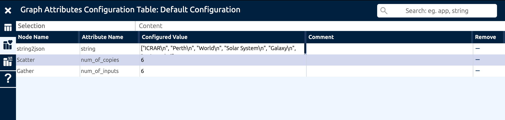
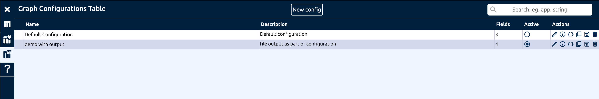

.. _graph-configurations:

Graph Configurations
====================

The Graph Configuration system allows a graph creator to expose important graph parameters from various components.
Think of it as a way to favourite certain parameters for a graph, so that they can be easily found and edited by the user.

Use graph configurations for values that vary between runs, such as dataset names, resource targets, or tuning parameters.
Keep the template stable and put only the changing values into the configuration.

When a component parameter is 'favourited' as part of a graph configuration, the configured value overrides the default value in the component description.

Graph configurations become active when a Logical Graph is created from a template (as the graph is sent to the DALiuGE translator).
At that point the values are applied before the graph is translated for execution.

  An example of a graph configuration for the HelloWorld-Universe graph

The EAGLE UI can be configured to allow users to only edit the parameters in the graph configuration, while keeping the rest of the graph template hidden.

  An example of multiple graph configurations for the HelloWorld-Universe graph

Multiple graph configurations can be created for a single graph template, allowing the same workflow to be reused in different ways with a different set of parameters marked as 'favourited'.