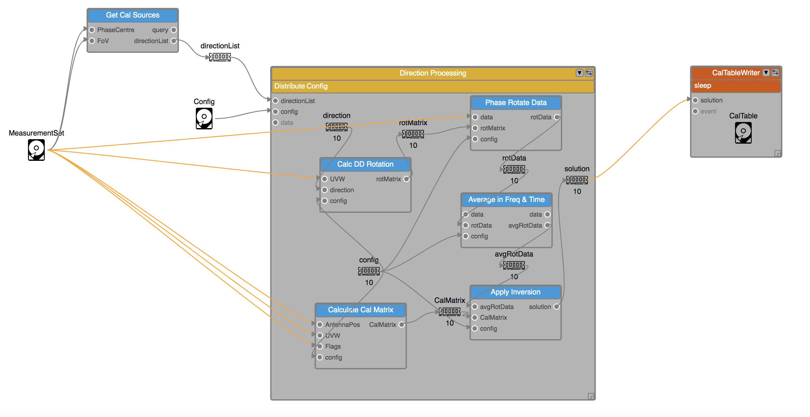
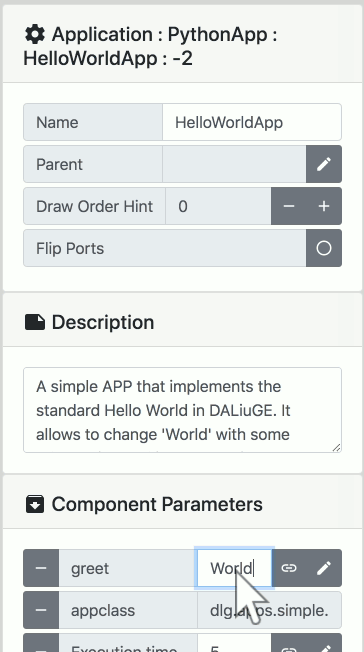
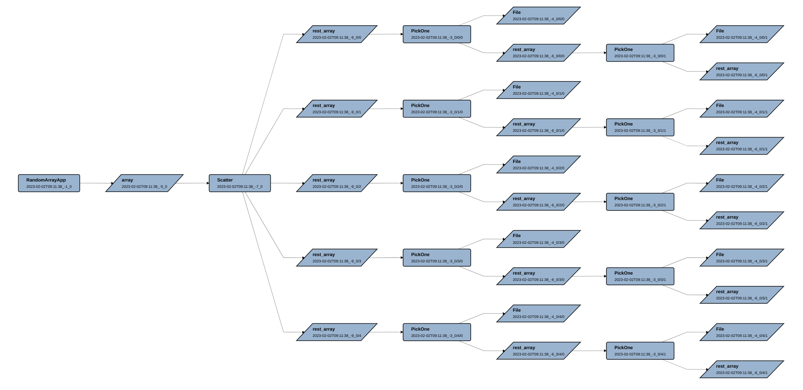

Templates and Graphs
====================

EAGLE workflows move through four stages.
You start with intent and end with an executable deployment.

.. raw:: html
    :file: _static/graphs_map.html

.. 
.. .. figure:: _static/images/templates_and_graphs.png
..   :width: 500px
..   :align: center
..   :alt: The progression of a workflow from Logical Graph Template to Physical Graph
..   :figclass: align-center
..
..   The progression of a workflow from Logical Graph Template to Physical Graph

Logical Graph Template
----------------------

A Logical Graph Template defines workflow structure.
It includes components, edges, and exposed parameters, but no run-specific values.

  An example of a Logical Graph Template

Templates are designed to be reused.
Keep them stable and expose only parameters users should tune.

Logical Graph
-------------

A Logical Graph is a template with parameter values filled in.
This is where a generic workflow becomes a run-ready logical definition.

  An example of a parameter for the HelloWorldApp being edited

Physical Graph Template
-----------------------

The DALiuGE translator converts the Logical Graph into a Physical Graph Template.
This stage applies partitioning and scheduling decisions for target resources.

  An example of a Physical Graph Template

Different translation algorithms may be available.
Choose based on your constraints, such as runtime or resource usage.

Physical Graph
--------------

A Physical Graph is the deployed form mapped to real compute resources.
EAGLE shows execution progress and failures for debugging and development.
Execution records are stored with run logs.
