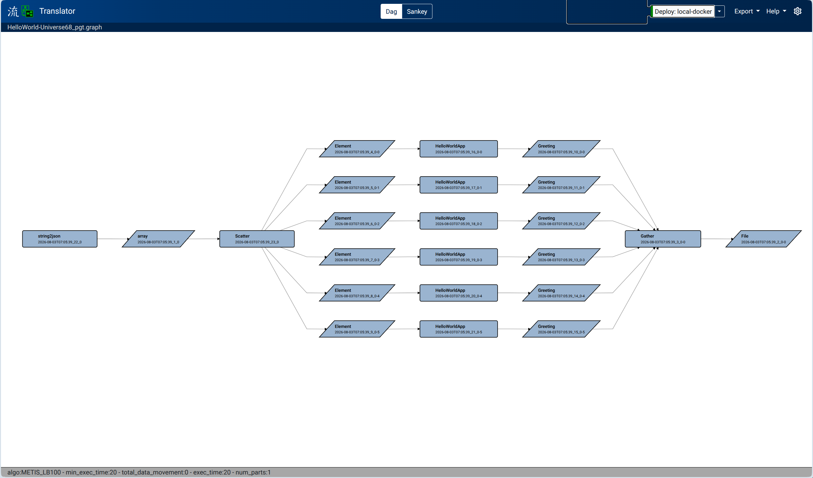
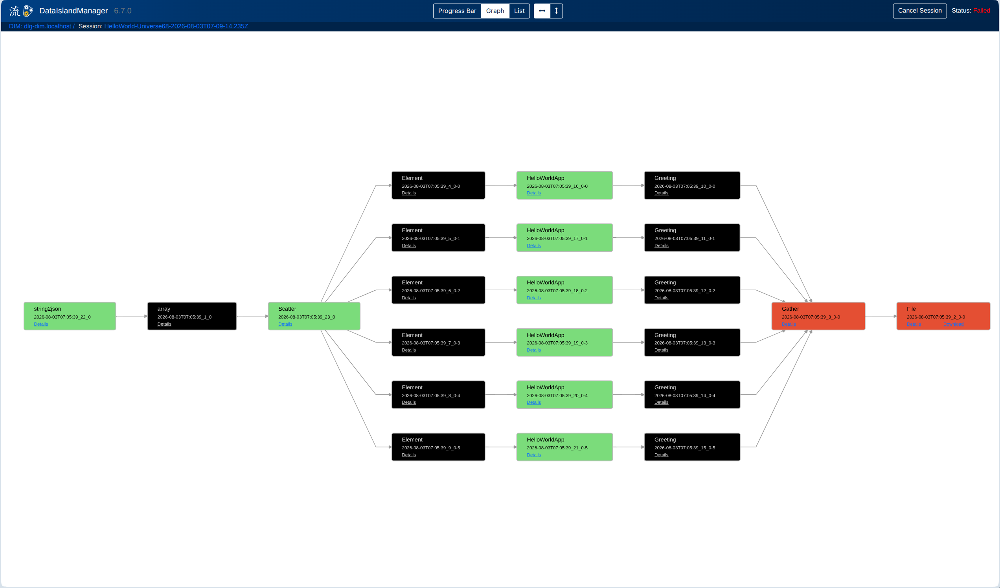

Templates and Graphs
====================

EAGLE workflows move through four stages.
You start with intent and end with an executable deployment.

.. raw:: html
    :file: _static/graphs_map.html

.. 
.. .. figure:: _static/images/templates_and_graphs.png
..   :width: 500px
..   :align: center
..   :alt: The progression of a workflow from Logical Graph Template to Physical Graph
..   :figclass: align-center
..
..   The progression of a workflow from Logical Graph Template to Physical Graph

Logical Graph Template
----------------------

A Logical Graph Template defines workflow structure.
It includes components, edges, and exposed parameters, but no run-specific values.
These exposed parameters can be defined as run-specific values as part of a ``graph configuration``, to simplify reuse of the template for different runs.

.. figure:: _static/images/components.png
  :width: 90%
  :align: center
  :alt: An example of a Logical Graph Template
  :figclass: align-center

  An example of a Logical Graph Template

Keep them stable and only add important parameters to the graph configuration, which are likely to change between runs.

Logical Graph
-------------

A Logical Graph is a Logical Graph Template with an activated ``graph configuration``.
At this point the graph configuration has been filled in by the user with run-specific values and has been applied when it was sent to the DALiuGE translator.

.. figure:: _static/images/graph_configuration.png
  :width: 90%
  :align: center
  :alt: An example of a graph configuration for the HelloWorld-Universe graph
  :figclass: align-center

  An example of a graph configuration for the HelloWorld-Universe graph

Physical Graph Template
-----------------------

The `DALiuGE <https://daliuge.readthedocs.io>`_ translator first converts the Logical Graph into a Physical Graph Template.
This stage applies partitioning and scheduling decisions for target resources.

  An example of a Physical Graph Template

Different translation algorithms are available.
Choose based on your constraints, such as runtime or resource usage.

Physical Graph
--------------

A Physical Graph is the deployed form where the partitions are mapped to compute nodes in a cluster.

  An example of a Physical Graph

The Engine UI shows the graph as it is executing (or just a progress bar). 
Nodes on the graph are changing colors as the execution progresses. 
They are light-yellow before execution and yellow during execution. 
After execution application nodes turn green or red, depending on whether they had been successful or not.  
Memory data nodes are turning first grey and then black, once they had been garbage collected. 
All nodes following a failed application node are turning red. It is possible to click on the nodes and get information from the DALiuGE logging system. 
For file data nodes it is also possible to download the data.
