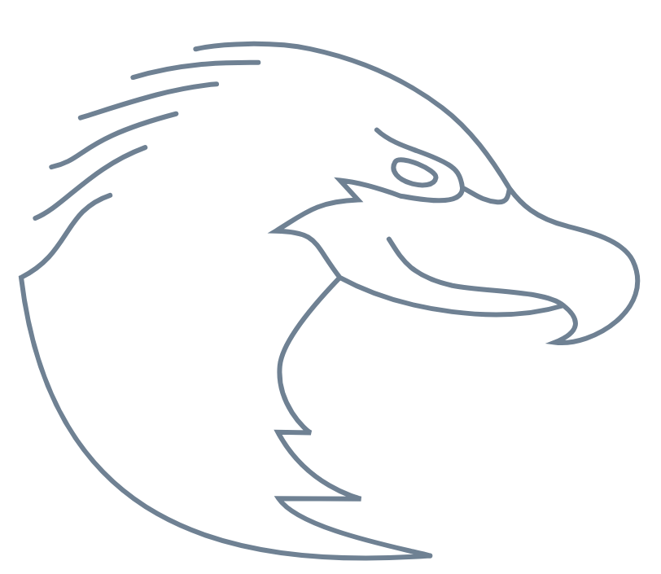

EAGLE :sup:`pi`
===============

EAGLE is the visual editor for building DALiuGE workflows.
This guide helps you go from first launch to your first runnable graph.

EAGLE is the UI for the `DALiuGE <https://daliuge.readthedocs.io>`_ workflow framework.
You design workflows as connected components, tune parameters, translate to a deployable graph, and then execute.

.. raw:: html

    

    <map name="process">
    <area shape="rect" coords="150,20,450,114" alt="Execution" href="#execution" style="outline-style:none">
    <area shape="rect" coords="150,115,450,222" alt="Translation" href="#translation" style="outline-style:none">
    <area shape="rect" coords="123,219,450,330" alt="Graph parameters" href="#graph-parameters" style="outline-style:none">
    <area shape="rect" coords="150,333,450,438" alt="Graph construction" href="#graph-construction" style="outline-style:none">
    <area shape="rect" coords="150,439,450,544" alt="Palette" href="#palette" style="outline-style:none">
    <area shape="rect" coords="150,545,450,648" alt="Component description" href="#component-description" style="outline-style:none">
    <area shape="rect" coords="150,649,450,756" alt="Component" href="#component" style="outline-style:none">
    <area shape="rect" coords="150,757,450,867" alt="Application" href="#application" style="outline-style:none">
    </map>

.. .. figure:: _static/images/full_process_diagram.png
..   :width: 600px
..   :align: center
..   :alt: Diagram of the full process from applications, to EAGLE workflows, to execution
..   :figclass: align-center
..
..   Diagram of the full process from applications, to EAGLE workflows, to execution

How EAGLE Works
===============

1. Build a workflow from :doc:`Components <components>`.
2. Organize components through :doc:`Palettes <palettes>`.
3. Create a :ref:`Logical Graph Template <logical-graph-template>` in the editor.
4. Set values to produce a :ref:`Logical Graph <logical-graph>`.
5. Translate it into a :ref:`Physical Graph Template <physical-graph-template>`.
6. Deploy and execute as a :ref:`Physical Graph <physical-graph>`.

A component can wrap many payload types, such as shell commands, Python code, C/C++, MPI apps, or data handlers.
Components are defined in JSON descriptions so EAGLE can display, validate, and connect them.

.. toctree::
   :maxdepth: 2
   :caption: Getting started
   :hidden:

   Installation <installation>
   Getting Started <gettingStarted>
   Hello World Example <helloWorld>
   Settings <settings>

.. toctree::
   :maxdepth: 2
   :caption: EAGLE Concepts
   :hidden:

   Components <components>
   Palettes <palettes>
   Graph Configurations <graphConfigurations>
   Templates and Graphs <graphs>
   Annotating Graphs <annotating>
   Tools <tools>

.. Indices and tables
.. ==================
.. * :ref:`genindex`
.. * :ref:`modindex`
.. * :ref:`search`

