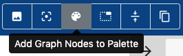

Palettes
========

A palette is a collection of :doc:`Components <components>` defined for a
specific domain or sub-domain -- for instance for radio astronomy, or for a
specific workflow used within radio astronomy. They are a convenient way to
provide a focused set of components and make them available within your workflow
development environment.

.. figure:: _static/images/palette.png
  :width: 250px
  :align: center
  :alt: An example of a palette in EAGLE
  :figclass: align-center

  An example of a palette with a focused set of components for a single workflow

The breadth and depth of a palette is completely up to the palette developers.
One palette could contain every possible component for a domain, or it could be
much more narrow and cover a single sub-domain or software package.

A palette developed for astronomy could potentially contain hundreds or thousands of radio
astronomy components, which would make it difficult to zero in on components
necessary to process an optical image. A more focused sub-domain palette could,
for instance, focus on one single experiment or instrument and only offer
components relevant to processing that data for a specific science goal.

Palettes can be generated/developed in two main ways, automatic and manual in EAGLE.

Creating Palettes Automatically from Source Code
------------------------------------------------

We have developed a stand-alone `tool <https://icrar.github.io/dlg_paletteGen/>`_ to automatically generate palettes from source code. It has been used to create palettes for a number of small and large code repositories and works without any modification of the code. In addition it can also extract the more dedicated component descriptions specifically written for DALiuGE.

Creating Palettes within EAGLE
------------------------------

EAGLE can also be used to create new palettes from scratch. To create Palettes within EAGLE,
first open the EAGLE settings and enable the "Allow Palette Editing" setting.

The next step is to create a component you would like to place in a palette
within the EAGLE graph editor. Typically, as user would use a component within
the "All Nodes" palette as a starting point for a new component. For example, to
create a component for some Python code, a user would drag a "Python App" from
the "All Nodes" palette into the graph editor as a starting point.

Next, the user would customise the "Python App" component, changing the name and
description as well as the *Application Class* component argument, and adding parameters and ports as appropriate.

Once the component is complete, it should be saved to a palette using the
"Add Selected Node to Palette" button at the top of the node inspector.
Since graphs usually require many components, a user could create and modify
multiple components within the graph editor, then add them all to a palette at
once, using the "Add Graph Nodes to Palette" button in the navbar. Obviously this process is quite hands-on and tedious and thus not really suited to create many components from scratch. However, it is very useful for fine-tuing existing components parameters, default values and ports.

  Click the "Add graph nodes to Palette" button in the navbar

The user can then click the "cloud" icon to save to git, or the "floppy disk" icon to save locally.
As with other components, we'd recommend saving to your own EAGLE GitHub or GitLab repository in a folder named after the palettes focus or use.

  The new palette containing a Docker component description
