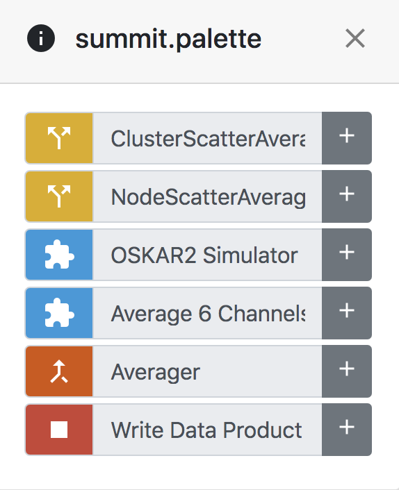
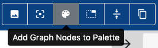
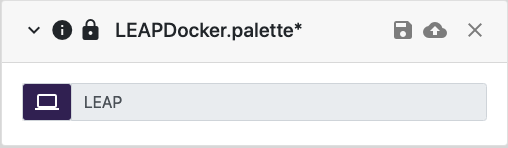

Palettes
========

A palette is a curated collection of :doc:`components <components>`.
It helps users find relevant nodes quickly for a domain, project, or workflow.

  An example of a palette with a focused set of components for a single workflow

Good palettes are focused.
Smaller, purpose-built palettes are usually easier to use than one large catch-all palette.

There are two main ways to create palettes: automatic generation and manual authoring.

Creating Palettes Automatically from Source Code
------------------------------------------------

Use the standalone `palette generation tool <https://icrar.github.io/dlg_paletteGen/>`_ to create component descriptions from source code.
This is the fastest option when onboarding existing codebases.

Creating Palettes within EAGLE
------------------------------

You can build palettes directly in EAGLE.

1. Enable ``Allow Palette Editing`` in settings.
2. Start from an existing node (often from ``All Nodes``).
3. Edit name, description, ports, and parameters.
4. Save one node with ``Add Selected Node to Palette`` or many with ``Add Graph Nodes to Palette``.

Manual editing is best for refinement and small curated palettes.

  Click the "Add graph nodes to Palette" button in the navbar

Save palettes locally or to Git repositories.
For collaboration, store them in a dedicated GitHub or GitLab repository.

  The new palette containing a Docker component description
