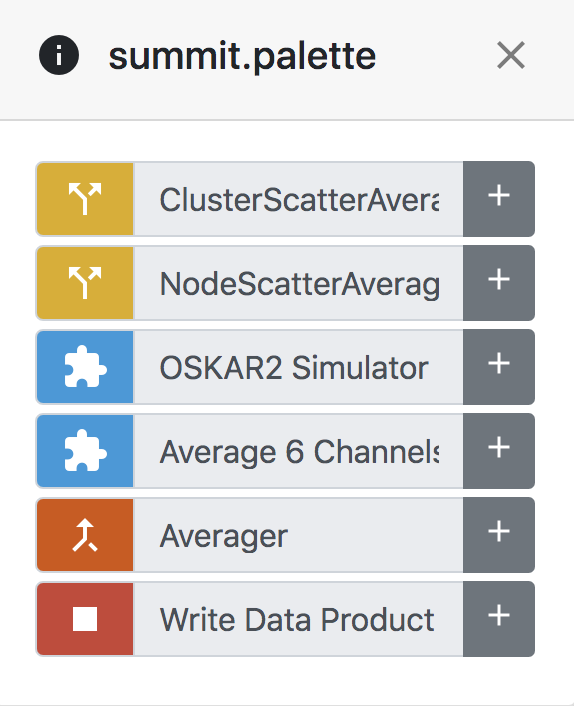

Palettes
========

A palette is a collection of :doc:`Components <components>` defined for a specific domain or sub-domain -- for instance for radio astronomy, or for a specific workflow used within radio astronomy. They are a convenient way to provide a focused set of components and make them available within your workflow development environment.

  An example of a palette with a focused set of components for a single workflow

The breadth and depth of a palette is completely up to the palette developers. One palette could contain every possible component for a domain, or it could be much more narrow and cover a single sub-domain.

A palette developed for astronomy could potentially contain hundreds of radio astronomy components, which would make it difficult to zero in on components necessary to process an optical image. A more focused sub-domain palette could, for instance, focus on one single experiment or instrument and only offer components relevant to processing that data.
