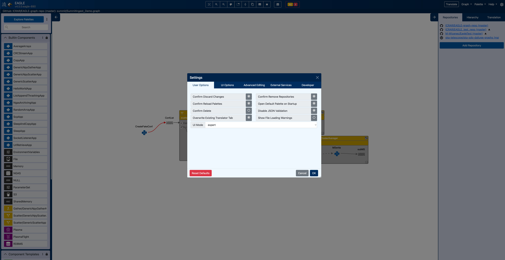

Settings
===================

The settings in Eagle include user experience and interface related options. By default, Eagle is simplified by hiding a lot of functionality via the UI modes. These settings may also affect permissions of what may be modified. The settings menu can be found in the nav-bar as a cog icon, or by pressing the keyboard shortcut 'O'.

  An example of a palette with a focused set of components for a single workflow

UI Modes
--------

Ui modes are collections of settings creating separate workspaces, each designed with a specific use case in mind.

**Minimal** - Designed for student use or when the goal is loading a graph, tweaking its key attributes and executing it through the translator.

**Default** - The ideal mode when deploying or editing graphs with additional information shown compared to minimal

**Graph** - Unlocks the permissions required for graph creation from pre-existing palettes and palette components

**Palette** - Being able to change all values on palette and graph components, as well as graph deployment functionality

**Expert** - Unlocks everything Eagle has to offer

**Custom** - Your mode, your way

Tabs Breakdown
--------------

**User Options**  -  General user experience options

**UI Options**  -  Settings that can simplify, hide or show sections of the UI that might not be necessary for a use case

**Advanced Editing**  -  Permission settings that unlock the ability to edit more components

**External Services**  -  This is where external services such as github and docker can be set up

**Developer**  -  Settings used by developers to debug Eagle

User Options
""""""""""""

**Confirm Discard Changes** - Prompt user to confirm that unsaved changes to the current file should be discarded when opening a new file, or when navigating away from EAGLE.

**Confirm Remove Repositories** - Prompt user to confirm removing a repository from the list of known repositories.

**Confirm Reload Palettes** - Prompt user to confirm when loading a palette that is already loaded.

**Confirm Delete** - Prompt user to confirm when deleting node(s) or edge(s) from a graph.

**Disable JSON Validation** - Allow EAGLE to load/save/send-to-translator graphs and palettes that would normally fail validation against schema.

**Overwrite Existing Translator Tab** - When translating a graph, overwrite an existing translator tab.

**Show File Loading Warnings** - Display list of issues with files encountered during loading.

**UI Mode** - User Interface Mode. Simple Mode removes palettes, uses a single graph repository, simplifies the parameters table. Expert Mode enables the display of additional settings usually reserved for advanced users.

UI options
""""""""""

**Show non key parameters** - Show additional parameters that are not marked as key parameters for the current graph.

**Display Node Keys** - Node keys are usually only necessary for troubleshooting purposes.

**Hide Palette Tab** - The Palette tab is not required for loading and executing graphs. Hiding it will reduce visual complexity.

**Hide Read Only Parameters** - Hide Read Only Parameters

**Translator Mode** - There are a few modes affecting the amount of permissions available:  **minimal** - using default algorithm and settings, hiding the translation tab. **Default** - using default algorithm allowing for some extra control via the translation tab. **Expert** - Offers additional translating algorithms.

**Graph Zoom Divisor** - The number by which zoom inputs are divided before being applied. Larger divisors reduce the amount of zoom.

**Show edge/node errors/warnings in inspector** - Show the errors/warnings found for the selected node/edge in the inspector, below the other editor widgets. Errors and warnings are always shown the the checkGraph display in the navbar.

Advanced Editing
""""""""""""""""

**Allow Invalid Edges** - Allow the user to create edges in the graph, even if they would normally be determined invalid.

**Allow Component Editing** - Allow the user to add/remove ports and parameters from components.

**Allow Palette Editing** - Allow the user to edit and create palettes.

**Allow Readonly Palette Editing** - Allow the user to modify palettes that would otherwise be readonly. These are usually only the default loaded palettes.

**Allow Edge Editing** - Allow the user to edit edge attributes.

**Auto-suggest destination nodes** - If an edge is drawn to empty space, EAGLE will automatically suggest compatible destination nodes.

External Services
"""""""""""""""""

**Translator URL** - The URL of the translator server

**GitHub Access Token** - A users access token for GitHub repositories.

**GitLab Access Token** - A users access token for GitLab repositories.

**Docker Hub Username** - The username to use when retrieving data on images stored on Docker Hub.

Developer
"""""""""

**Translate With New Categories** - Replace the old categories with new names when exporting. For example, replace 'Component' with 'PythonApp' category.

**Open Translator In Current Tab** - When translating a graph, display the output of the translator in the current tab.

**Create Applications For Construct Ports** - When loading old graph files with ports on construct nodes, move the port to an embedded application.

**Skip 'Closes Loop' Edges In JSON Output** - We've recently added edges to the LinkDataArray that 'close' loop constructs and set the 'group_start' and 'group_end' automatically. In the short-term, such edges are not supported by the translator. This setting will keep the new edges during saving/loading, but remove them before sending the graph to the translator.

**Print Undo State To JS Console** - Prints the state of the undo memory whenever a change occurs. The state is written to the browser's javascript console.

**Use Old Output Format** - Prolong use of 'old' output format, with 'inputPorts' and 'outputPorts' arrays, while corresponding changes to DALiuGE are in progress.
