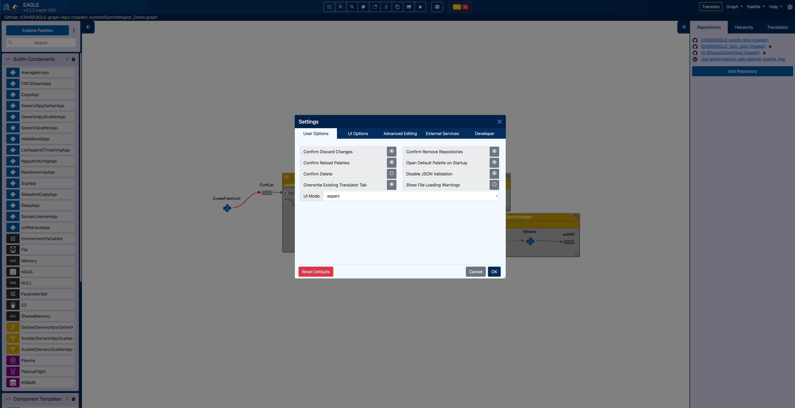

Settings
========

Settings control how much of EAGLE is visible and editable.
Open settings from the gear icon, or press ``O``.

UI Modes
--------

UI modes are preset permission and visibility profiles.

- **Minimal**: load, inspect, and run with limited editing.
- **Graph**: create and edit graphs from existing components.
- **Component**: edit component and palette details, plus deployment-related actions.
- **Expert**: full access to all available features.

Tabs Overview
-------------

- **User Options**: general behavior and safety prompts.
- **UI Options**: simplify or expand interface behavior.
- **Advanced Editing**: granular edit permissions.
- **External Services**: tokens, repositories, and translator endpoint.
- **Developer**: debugging and migration helpers.

User Options
""""""""""""

- **Reset Action Confirmations**: re-enable confirmation prompts previously disabled.
- **Disable JSON Validation**: allow loading, saving, and translating JSON that fails schema checks.
- **Overwrite Existing Translator Tab**: reuse an open translator tab on each translation.

UI Options
""""""""""

- **Show non key parameters**: show parameters not marked as key.
- **Translator Mode**: ``minimal`` (simplest flow), ``default`` (standard controls), ``expert`` (advanced options).
- **Graph Zoom Divisor**: reduce zoom sensitivity by increasing divisor.
- **Show edge/node errors/warnings in Graph**: display validation output in node and edge inspectors.

Advanced Editing
""""""""""""""""

- **Allow Invalid Edges**: create edges even when validation rejects them.
- **Allow Component Editing**: edit component ports and parameters.
- **Allow Modify Graph Configurations**: edit graph configuration parameters.
- **Allow Graph Editing**: create and modify graphs.
- **Allow Palette Editing**: create and modify palettes.
- **Allow Readonly Palette Editing**: edit palettes normally marked readonly.
- **Allow Edge Editing**: edit edge attributes directly.
- **Filter Node Suggestions**: filter autocomplete node options while drawing edges.
- **Value Editing**: ``Config Only``, ``Normal``, or ``Readonly``.
- **Auto-complete edges level**: minimum validity level for suggested edges.

External Services
""""""""""""""""""""

- **Translator URL**: DALiuGE translator endpoint.
- **GitHub Access Token**: token for GitHub read and write actions.
- **GitLab Access Token**: token for GitLab read and write actions.
- **Docker Hub Username**: account used for image metadata lookup.
- **Explore Palettes Service**: repository host used by Explore Palettes.
- **Explore Palettes Repository**: repository used by Explore Palettes.
- **Explore Palettes Branch**: branch used by Explore Palettes.

Developer
"""""""""

- **Show Developer Notifications**: show internal diagnostic messages.
- **Show File Loading Warnings**: display file issues encountered on load.
- **Open Translator In Current Tab**: reuse current tab for translator output.
- **Create Applications For Construct Ports**: migrate legacy construct-node port behavior.
- **Skip 'Closes Loop' Edges In JSON Output**: omit translator-incompatible loop-closing edges.
- **Print Undo State To JS Console**: log undo history state changes.
- **Display all Category options**: show full category list in node category editor.
- **Allow modified graph translation**: translate even if a graph is unsaved or uncommitted.
- **Apply active graph config before translation**: apply current graph config before translator submission.
- **Fetch repository for URLs**: auto-fetch repository content when URL-specified graph or palette is loaded.