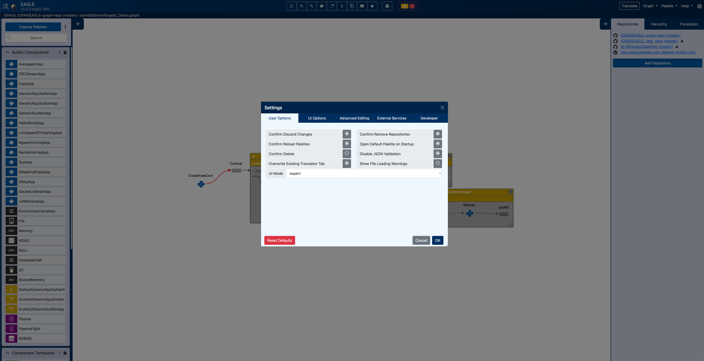

Settings
========

Settings control how much of EAGLE is visible and editable.
Open settings from the gear icon, or press ``O``.

UI Modes
--------

UI modes are preset permission and visibility profiles.

- **Minimal**: load, inspect, and run with limited editing.
- **Graph**: create and edit graphs from existing components.
- **Component**: edit component and palette details, plus deployment-related actions.
- **Expert**: full access to all available features.

Tabs Overview
-------------

- **User Options**: general behavior and safety prompts.
- **UI Options**: simplify or expand interface behavior.
- **Advanced Editing**: granular edit permissions.
- **External Services**: tokens, repositories, and translator endpoint.
- **Developer**: debugging and migration helpers.

User Options
""""""""""""

- **Reset Action Confirmations**: re-enable confirmation prompts previously disabled.
- **Confirm Discard Changes**: prompt before discarding unsaved edits when opening a new file or leaving EAGLE.
- **Confirm Node Category Changes**: warn when changing a node category could break the node.
- **Confirm Remove Repositories**: confirm removing repositories from the known-repositories list.
- **Confirm Delete Files**: confirm deleting files from a repository.
- **Confirm Delete Objects**: confirm deleting nodes or edges from a graph.
- **Confirm OJS Format Save**: warn before saving in the older OJS format.
- **Open Builtin Palette on Startup**: open the built-in palette automatically when EAGLE starts.
- **Open Template Palette on Startup**: open the template palette automatically when EAGLE starts.
- **Disable JSON Validation**: allow loading, saving, and translating JSON that fails schema checks.
- **Overwrite Existing Translator Tab**: reuse an open translator tab on each translation.
- **Test Translate Mode**: remove the requirement to save before translating.
- **Markdown Editing Enabled**: enable edit mode in the markdown editor modal.

UI Options
""""""""""

- **Show non key parameters**: show parameters not marked as key.
- **Show Developer Tab**: reveal the Developer tab in the settings dialog.
- **Translator Mode**: ``minimal`` (simplest flow), ``normal`` (standard controls), or ``expert`` (advanced options).
- **Graph Zoom Divisor**: reduce zoom sensitivity by increasing the divisor.
- **Snap To Grid**: align node positions to a grid.
- **Snap To Grid Size**: set the size of the grid used for snapping.
- **Show edge/node errors/warnings in Graph**: display validation output in node and edge inspectors.
- **Right Window Width / Visibility / Mode**: save the right-hand panel width, visibility state, and active tab.
- **Left Window Width / Visibility**: save the left-hand panel width and visibility state.
- **Bottom Window Height / Visibility / Mode**: save the lower panel height, visibility state, and active tab.
- **Graph and Object Inspector**: save the collapsed state of the graph/object inspector.
- **Visibility of data node titles**: show or hide titles on data nodes.
- **Visibility of visuals in graph**: show or hide graph visuals.

Advanced Editing
""""""""""""""""

- **Allow Invalid Edges**: create edges even when validation rejects them.
- **Allow Component Editing**: edit component ports and parameters.
- **Allow Modify Graph Configurations**: edit graph configuration parameters.
- **Allow Graph Editing**: create and modify graphs.
- **Allow Palette Editing**: create and modify palettes.
- **Allow Readonly Palette Editing**: edit palettes normally marked readonly.
- **Filter Node Suggestions**: filter autocomplete node options while drawing edges.
- **STUDENT_SETTINGS_MODE**: disable editing of settings for student-mode workflows.
- **Disable Rename on Edge Connect**: prevent nodes from being renamed when edges are connected.
- **Value Editing**: ``Config Only``, ``Normal``, or ``Readonly``.
- **Auto-complete edges level**: minimum validity level for suggested edges.
- **Default Data Node**: choose the default category for data nodes created automatically.

External Services
""""""""""""""""""""

- **Translator URL**: DALiuGE translator endpoint.
- **GitHub Access Token**: token for GitHub read and write actions.
- **GitLab Access Token**: token for GitLab read and write actions.
- **Docker Hub Username**: account used for image metadata lookup.
- **Default Translation Algorithm**: choose the default translation algorithm used by EAGLE.

Developer
"""""""""

- **Show Developer Notifications**: show internal diagnostic messages.
- **Show File Loading Warnings**: display file issues encountered on load.
- **Open Translator In Current Tab**: reuse the current tab for translator output.
- **Create Applications for Construct Ports**: migrate legacy construct-node port behavior.
- **Skip 'closes loop' edges in JSON output**: omit translator-incompatible loop-closing edges.
- **Print Undo state to JS Console**: log undo history state changes.
- **Print Translator JSON to JS Console**: print the JSON sent to the translator to the browser console.
- **Display all Category options**: show the full category list in the node category editor.
- **Allow modified graph translation**: translate even if a graph is unsaved or uncommitted.
- **Fetch repository for URLs**: auto-fetch repository content when a URL-specified graph or palette is loaded.
- **Keep Old Fields during Category Change**: preserve old fields when changing a node category.
- **DALiuGE Schema Version**: select the JSON schema version used for saving and translation.