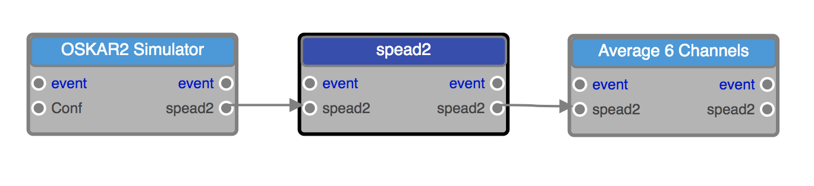
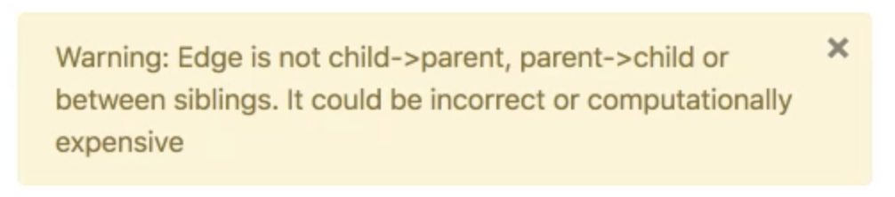
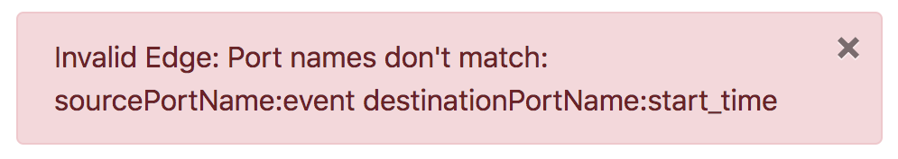

Components
==========

Components are created by application developers and others to be used within an EAGLE workflow. The components themselves exist outside of EAGLE, and may be *Application Components* such as command line (shell) code, in-line Python and C/C++ dynamic libraries, and MPI code; or they can be *Data Components*, such as Memory, File, S3 and NGAS. Each of these provide different underlying functionality and integration.

To create a workflow, EAGLE only needs to access JSON representations of each component, which contain enough information to translate the workflow into a graph and then execute it correctly. These JSON files are referred to as *component descriptions*.

During the execution of a workflow, the executables and data wrapped by a component description have to be available to the execution engine; however, during the development of a Palette or translation into a Physical Graph Template, these don't need to be accessible by EAGLE.

In this documentation, a distinction isn't made between the component's external code and its description unless it is necessary for clarity.

.. figure:: _static/images/components.png
  :width: 400px
  :align: center
  :alt: An example of components in EAGLE
  :figclass: align-center

  An example of different components in EAGLE. Each component has inputs and outputs. They can be arranged as parents and children, and their inputs and outputs can be linked using *edges*.

Each component has a set of inputs and outputs, as well as exposed parameters. Executable code called by an Application Component may range from the most simple -- for example, just a single mathematical operation in Python or C, to a complete and complex workflow all by itself. The inner workings of the Application Component are not handled within EAGLE.

In combination, components allow the parallel reduction of many individual data sets.

Linking Components with edges
-----------------------------

Within EAGLE, an output port from one component may be connected to the input port of another component via an *edge*. This is illustrated graphically by an arrow linking the two. An edge represents an event triggered by one component that in turn triggers other components to be processed.

It is only possible to link components that meet certain criteria, and some edges are inadvisable as they may affect performance. EAGLE provides error and warning messages when these edges are created.

  Here three components are linked together with edges.

  A warning message (above) and an error message (below) caused by the creation of an edge that may affect performance or is invalid.
