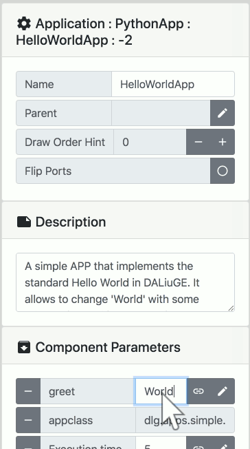
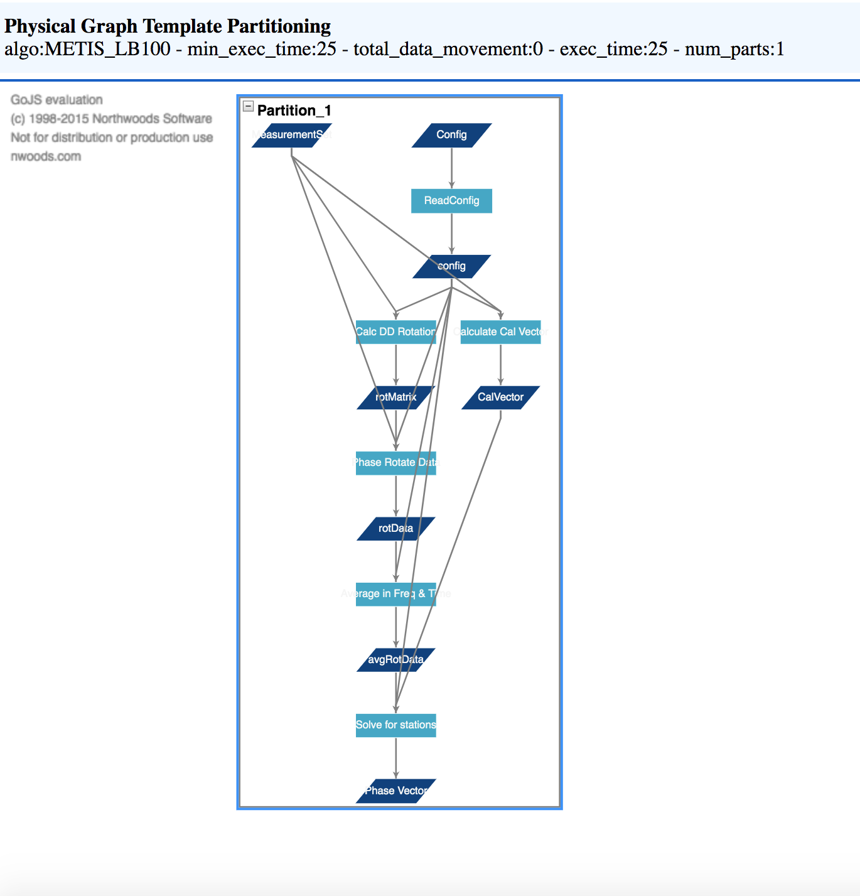

Templates and Graphs
====================

The process of constructing a workflow using EAGLE begins at the most general level -- a Logical Graph Template, and moves through a series of steps to the most specific level -- a Physical Graph. The steps are shown in the following diagram:

.. raw:: html
    :file: _static/graphs_map.html

.. 
.. .. figure:: _static/images/templates_and_graphs.png
..   :width: 500px
..   :align: center
..   :alt: The progression of a workflow from Logical Graph Template to Physical Graph
..   :figclass: align-center
..
..   The progression of a workflow from Logical Graph Template to Physical Graph

Logical Graph Template
----------------------

Logical Graph Templates are created within the EAGLE drag-and-drop interface. They are usually designed for one experiment or one instrument, but they allow some flexibility in the form of exposed parameters that may be set to different values by the user prior to execution.

.. figure:: _static/images/logical_graph_template.png
  :width: 700px
  :align: center
  :alt: An example of a Logical Graph Template
  :figclass: align-center

  An example of a Logical Graph Template

In an operational environment Logical Graph Templates represent different data processing modes, and after a period of development and use they will become quite stable. They can increase in complexity very quickly; however if developers approach them as a template and use the ability to expose adjustable parameters, this can highlight the inherent parallelism and potential bottlenecks of complex workflows. Logical Graph Templates provide a birds-eye view of an arbitrarily parallel process, even though parallelism isn't explicitly represented at this stage of the workflow.

Logical Graph
-------------

Logical Graphs are constructed from Logical Graph Templates by setting the exposed parameters of the graph's :doc:`Components <components>`. In general, most of these parameters are settings that influence the behaviour of the components, while some others control the size or the parameterisation of the data being processed.

  An example of a parameter for the HelloWorldApp being edited

Physical Graph Template
-----------------------

Physical Graph Templates are calculated from Logical Graphs by the DALiuGE translation engine, and then displayed within the EAGLE interface. They represent a translation of a Logical Graph into a Directed Acyclic Graph, and a mapping of that graph onto a potentially available cluster.

  An example of a Physical Graph Template

The DALiuGE translation engine implements multiple algorithms for the translation, but the result is always a Physical Graph Template partitioned in a way to meet the hardware capabilities and any additional constraints given to the algorithms (e.g. minimise run-time). Since some of the translation algorithms are quite expensive and time consuming to run, it is good practice to generate them as soon as the parameterisation of the reduction run is clear.

Physical Graph
--------------

Physical Graphs represent the final mapping of the Physical Graph Templates to available computer node(s), in the final step before execution. EAGLE displays the deployed graph and shows progression of the execution. It provides  a visualisation during execution time which is just informative and will not scale to many thousands or millions of tasks. However, it shows failures immediately, providing a helpful tool during graph development. Physical Graphs are completely bound to an actual execution of a workflow, and will be saved as part of the logs.
