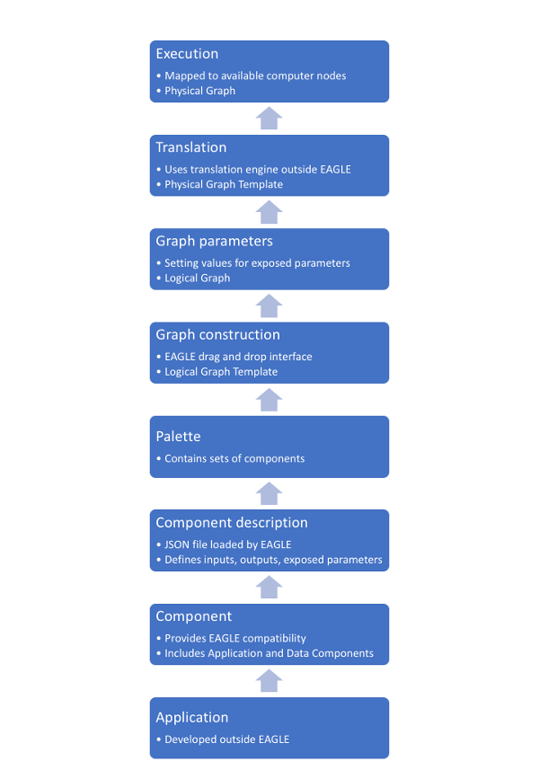

Introduction to Eagle
=====================

EAGLE is an interface designed to streamline and simplify workflow development, while creating a clear separation of different concerns and operational constraints. A major aim of EAGLE and its larger workflow creation model is to allow code to be as re-usable as possible, while still enabling highly optimised and integrated ways of implementing or migrating algorithms. It is also concerned with optimising the granularity and potential parallelism of workflows.

  Diagram of the full process from applications, to EAGLE workflows, to execution

As illustrated in the above diagram, an EAGLE workflow may integrate any number of applications that have been developed for different purposes. These may range from simple command line shell scripts to Python programs, C/C++ dynamic libraries and MPI applications.

Workflows within EAGLE are built from :doc:`Components <components>`. Some components provide compatibility with applications developed separately to EAGLE, while others are stand-alone.

Components are loaded into EAGLE via JSON files, referred to as Component Descriptions, containing all the specifications required for EAGLE to display and integrate each component.

A :doc:`palette <palettes>` is used to group components together, to make it easier and more efficient to access components that are relevant to a particular workflow or domain.

Within the EAGLE drag-and-drop interface, :doc:`Logical Graph Templates <graphs>` are constructed.

EAGLE allows values to be set for the exposed parameters of each component. Once these parameters are defined for a specific workflow, the graph is no longer considered a template, and is referred to as a :doc:`Logical Graph <graphs>`.

A completed Logical Graph may then be :doc:`translated <translation>` by the DALiuGE translation engine, using a selected algorithm. A translated graph is referred to as a :doc:`Physical Graph Template <graphs>`.

The final step is :doc:`execution <Execution>`. This occurs on a selected facility, where the Physical Graph Template is mapped to specific computer nodes. At this stage it is a :doc:`Physical Graph <graphs>`.
