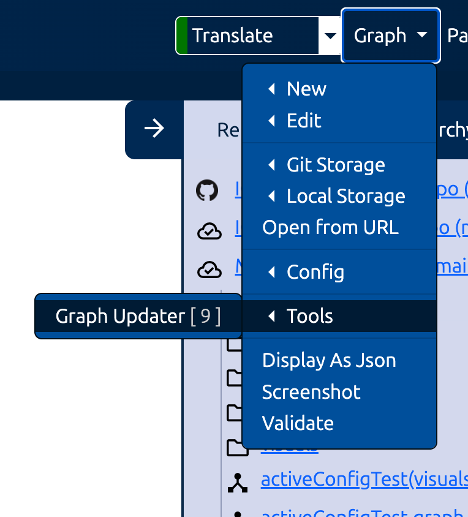
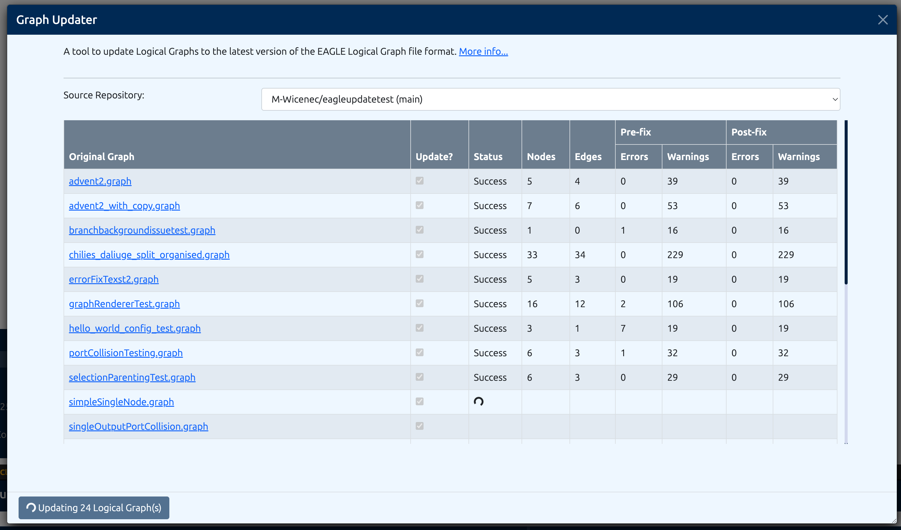

Tools
========

Graph Update Tool
------------------------------------------------

A tool to update Logical Graphs within a repository to the latest version of the EAGLE Logical Graph file format.

It can be accessed from the Tools menu within the Graph dropdown in the navbar or via the triple dot menu on repositories in the repository menu.

The tool will scan the selected repository for Logical Graphs and update them to the latest version of the EAGLE Logical Graph file format. You are given the choice to review the changes before applying them.
The updated Logical Graphs can be saved in a new branch of the source repository, an existing branch of the source repository, or a different repository altogether.

Typically, the destination repository is a branch of the source repository. Once the updated Logical Graphs have been verified by the user, we leave it to the user to merge the new branch outside of EAGLE.